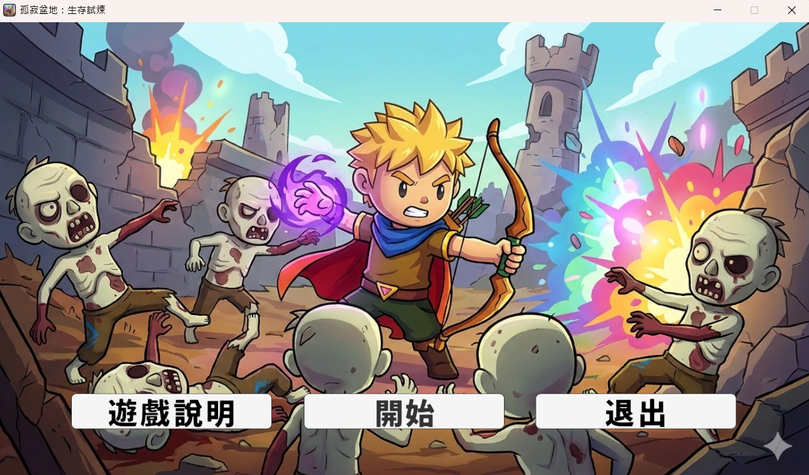
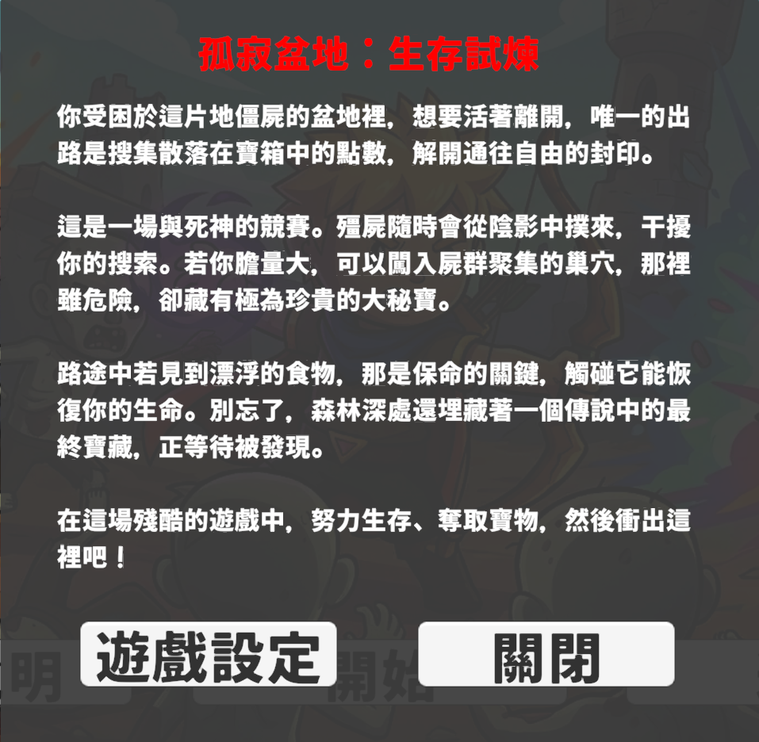
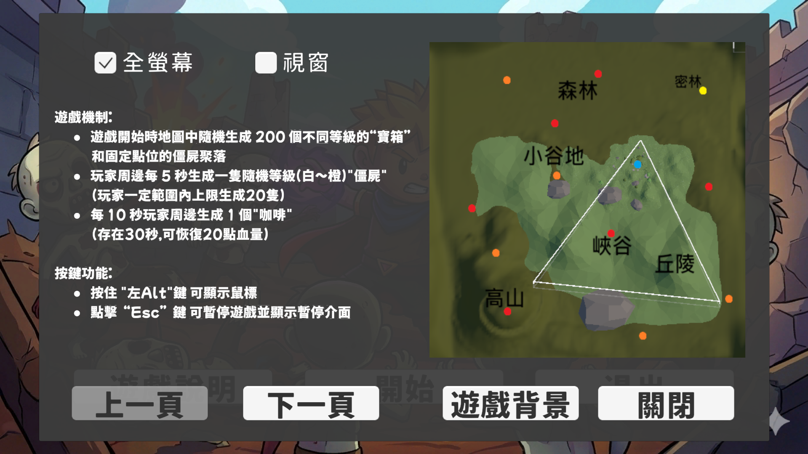
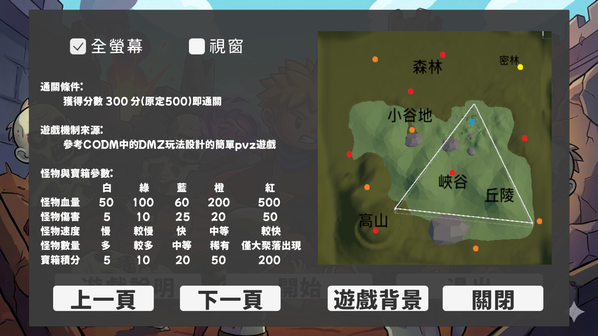
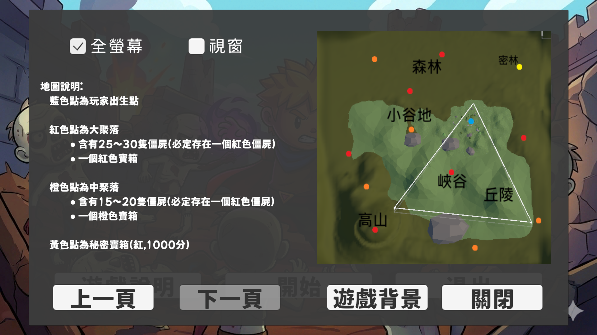
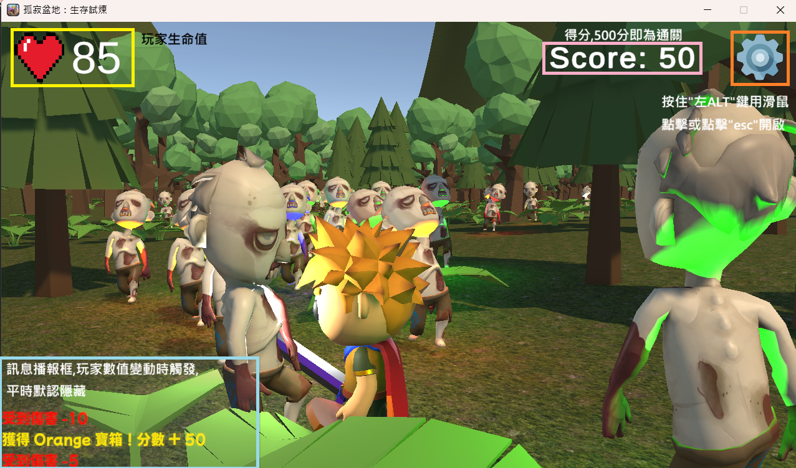
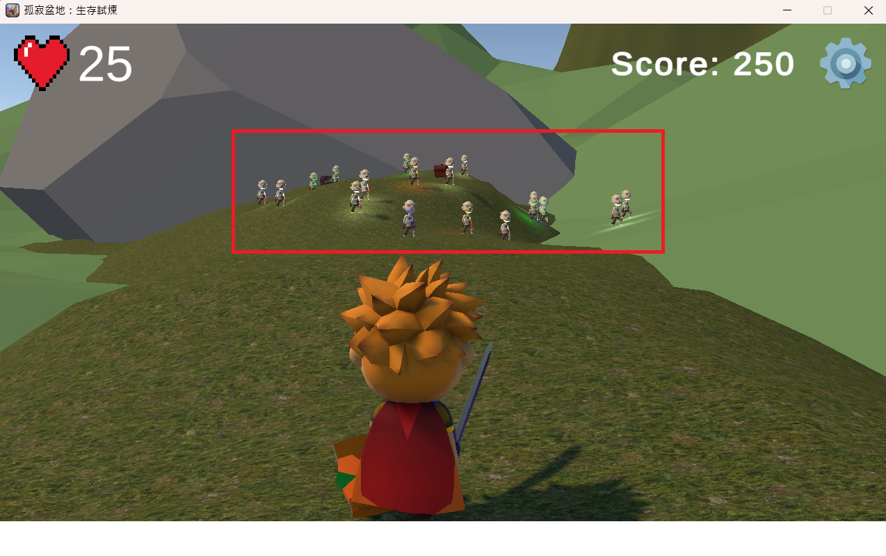

# 🏔️ 孤寂盆地：生存試煉 (Lonely Basin: Trial of Survival)

一款以**生存**為主題的 3D 動作遊戲，玩家將在孤立的盆地環境中面對各種挑戰，探索求生。

## 專案說明

本遊戲由 Unity 引擎開發，靈感取自CODM與三角洲行動的搜打撤模式。玩家可透過操縱角色在地圖中搜索寶箱，期間怪物會不斷在玩家周遭生成，玩家必須選擇擊殺或躲避怪物，在被怪物擊殺前獲取足夠的分數以撤離地圖。

*備註：角色建模皆取自Unity Asset Store免費開源模型。*

## 遊戲畫面

### 主畫面


### 遊戲背景

### 遊戲說明




### 遊戲畫面


### 怪物聚集地


## 遊戲特色

- 3D 開放式生存探索
- 獨特的盆地地形設計
- 挑戰性的生存關卡

## 技術棧

- **引擎**：Unity（Windows 64-bit 建置）
- **語言**：C#
- **渲染**：DirectX 12 (D3D12)
- **Runtime**：Mono / .NET

## 執行方式

直接執行 `孤寂盆地：生存試煉.exe` 即可開始遊戲（需 Windows 系統）。

## 檔案結構

```
Lonely Basin_Trial of Survival/
├── 孤寂盆地：生存試煉.exe          # 遊戲執行檔
├── UnityPlayer.dll                # Unity 執行環境
├── UnityCrashHandler64.exe        # 崩潰報告工具
├── D3D12/                         # DirectX 12 相關檔案
├── MonoBleedingEdge/              # Mono 執行環境
└── 孤寂盆地：生存試煉_Data/        # 遊戲資源目錄
```

## 開發者

- **開發者**：汪章貴
- **引擎**：Unity Game Engine
